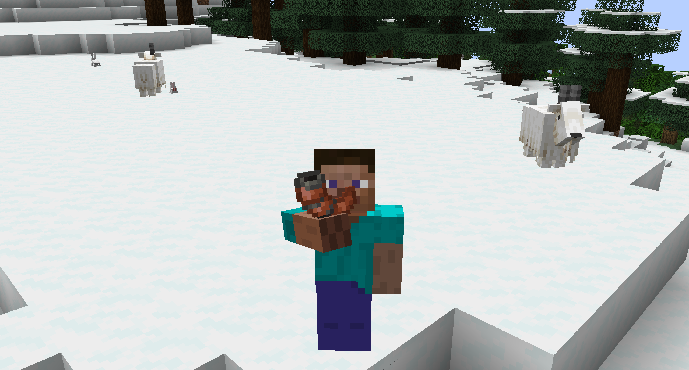

# ReturnCopperHorns
Fabric mod that re-implements the Copper Horn that was added and removed in the Bedrock Previews

There are ten different copper horn instruments which can be crafted from a goat horn. Four of which can only be crafted with a screaming goat horn.
Each instrument can play three different sounds depending on whether you are standing, sneaking, or looking up. 

All sounds and textures are property of Mojang Studios.